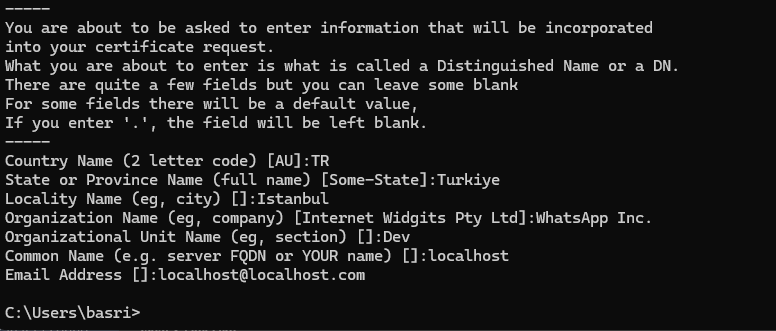

1. dockerbuild.sh: Docker image altyapısından sorumludur.
2. choco install openssl: Production ortamında https kullanım openssl kurulumudur.
3. openssl req -x509 -nodes -days 365 -newkey rsa:2048 -keyout nginx-selfsigned.key -out nginx-selfsigned.crt: SSL Encryption anahtarı oluşturma komutudur.
   - 
   - localhost tanımı zorunludur. Yoksa, tarayıcıda güvenlik hatası alırız.
4. 